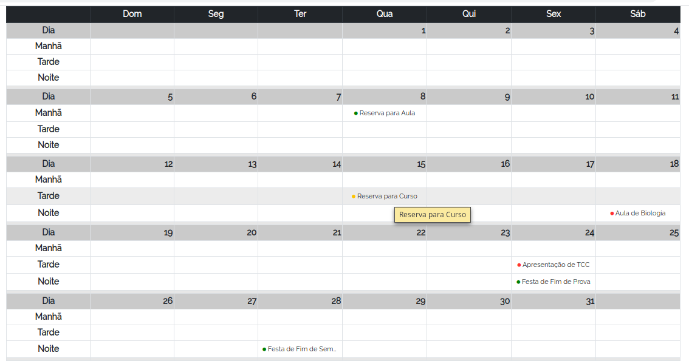

## Calendário de Resevas

> Pequeno componente para ser usado como consulta para calendário de reservas.

### **Dependências**

 - Jquery 3.3.1
 - Bootstrap 4.1.3

### **Instalação**


*No `<head>` da página:*

```html
<!DOCTYPE html>
<html lang="pt-br">
<head>
    <link rel="stylesheet" href="bootstrap.min.css">
</head>
```

*No fim do `<body>`:*

```html
<script src="jquery-3.3.1.min.js"></script>
<script src="bootstrap.min.js"></script>
<script src="ReservationCalendar.js"></script>
```

### **Como usar:**

*Logo após as tags `<script>`:*

```js

var _data = [
      {
        date: "8-05-2019",
        classroom: 1,
        evento: "Reserva para Aula",
        status: 'A',
        shift: "M"
      },
      {
        date: "15-05-2019",
        classroom: 1,
        evento: "Reserva para Curso",
        status: 'E',
        shift: "T"
      },
      {
        date: "18-05-2019",
        classroom: 1,
        evento: "Aula de Biologia",
        status: 'R',
        shift: "N"
      },
      {
        date: "24-05-2019",
        classroom: 1,
        evento: "Apresentação de TCC",
        status: 'R',
        shift: "T"
      },
      {
        date: "24-05-2019",
        classroom: 1,
        evento: "Festa de Fim de Prova",
        status: 'G',
        shift: "N"
      },
      {
        date: "28-05-2019",
        classroom: 1,
        evento: "Festa de Fim de Semestre",
        status: 'A',
        shift: "N"
      }
    ]

    a = new ReservationCalendar(
      {
        weekName: ["Dom", "Seg", "Ter", "Qua", "Qui", "Sex", "Sáb"],
        dayName: "Dia",
        varNames: {
          date: "date",
          event: "evento",
          status: {
            name: "status",
            confirmed: "A",
            refused: "R",
            waiting: "E"
          },
          shift: "shift"
        }
      })

    a.updateCalendar(_data, '2019-05-0')

```

### Example preview:

